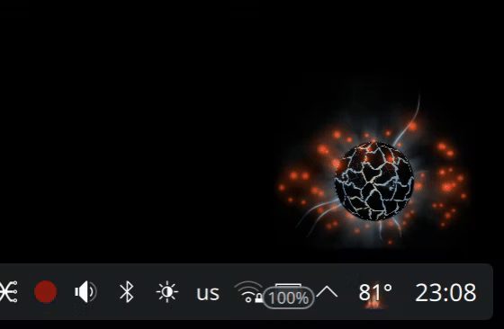

<p align="center">
  
</p>

<h1 align="center">CPU Flame</h1>

<p align="center">
  
</p>

<hr/>

CPU Flame is a KDE Plasma 6 widget that shows CPU load and temperature as an animated flame.

It works in both places:
- Plasma panel
- Plasma desktop

## Features

- Flame height follows CPU load.
- Flame color follows CPU temperature.
- Styles: `Classic`, `Ember`, `Plasma`.

## Install

Install directly from GitHub with a one-liner:

```bash
bash <(curl -fsSL https://raw.githubusercontent.com/khlesk/cpuflame/master/scripts/install)
```

For fish:

```fish
bash (curl -fsSL https://raw.githubusercontent.com/khlesk/cpuflame/master/scripts/install | psub)
```

After that, add **CPU Flame** from the Plasma widget picker.

## Development

Clone the repository and enter the project directory:

- `git clone https://github.com/khlesk/cpuflame.git`
- `cd cpuflame`
